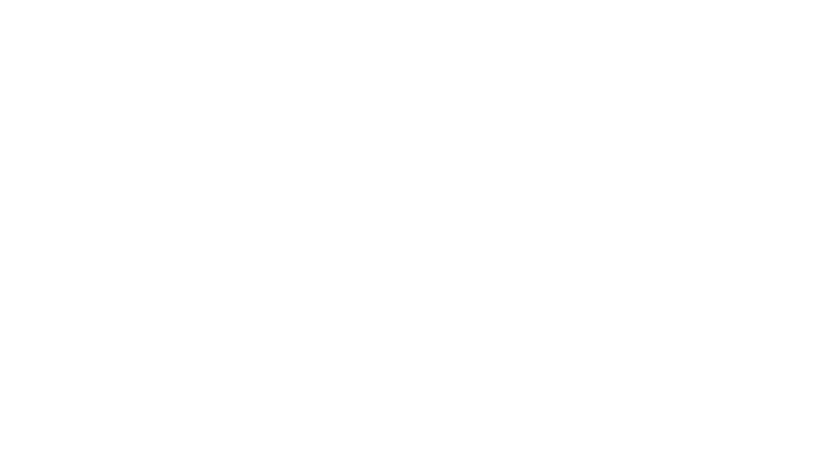

# Online Store - ddeoli 떨이
<!DOCTYPE html>
<html>
<head>
</head>
<body>
<p align="center"></p>
</body>
</html>


Projeto para a matéria **SSC0219 - Introdução ao desenvolvimento web**.

## Membros

- Beatriz Aparecida Diniz     | NUSP 11925430
- Lourenço de Salles Roselino | NUSP 11796805
- Melissa Motoki Nogueira     | NUSP 5588687

## Requisitos
### Visão Geral
* O sistema simula uma loja virtual de roupas inspiradas em tendências do leste-asiático.
* O sistema possui dois tipos de usuários: Clientes e Admnistradores.
    * Administradores, responsaveis pela a adição de manutenção de novos produtos e usuário.
    * Clientes, que vão acessar o sistema para comprar roupas e acessórios.
    * A aplicação já vem com uma conta padrão de administrador com ``` login: admin; senha: admin```.
* O sistema deve permitir que o usuário adicione seus produtos a um "carrinho", escolhendo quantidade e posteriormente compre o produto pagando por cartão de crédito.
    * O usuário logado pode adicionar/remover itens do carrinho.
    * A compra pode ser concluída após o cliente confirmar/adicionar o endereço de entrega e os dados do cartão para pagamento.
    
### Registros de Dados
* **Admnistradores** e **Clientes**: id, nome, telefone e um cadastro (email e senha). 
* **Produtos (roupas e acessórios)**: id, nome, preço, descrição, coleção (Synk Dive, Wildside ou Maniac), preço, quantidade em estoque e quantidade vendida.
* **Pedidos (compras de usuários)**: id, data, email do usuário, items, quantidade de cada item, total da compra.

### Funcionalidade Extra 
* O usuário poderá acessar um histórico de compras realizadas na loja. Somente um Administrador pode excluir o Pedido. Nenhum dos usuários é capaz de editá-lo.

### Requisitos Não Funcionais
* O sistema deve ser responsivo e possuir boa usabilidade.  
* O sistema deve permitir que o usuário acesse informações de seus pedidos.
    

## Descrição do projeto

O projeto consiste de uma _plataforma web_ para compra de roupas e acessórios baseados em grupos e _idols_ de _kpop_, permitindo a busca e compra de roupas, listagens por categorias e grupos e também inserção, atualização e remoção de produtos por admins. O sistema vai ser desenvolvido utilizando Vue e Bootstrap para o _front-end_ e NodeJs para o _back-end_ com _deploy_ do sistema podendo ser feito por Docker ou manualmente.

O nome _ddeoli (떨이)_ é uma palavra da língua coreana. O termo refere-se aos últimos itens no estoque de uma loja, o inventório final que o vendedor oferece (normalmente, a preços baixos) para esvaziar as prateleiras.

## Comentários sobre o código

Utilizou-se o padrão de projeto do VueJS (na versão 3) com pastas: components, views, assets, css globais.
Ainda, foram utilizados os frameworks Bootstrap 5 e MDBootstrap 5 para o desenvolvimento responsivo.

`Foi usado localStorage para simular o funcionamento do backend. Além de um arquivo de dados, ao invés dos dados do banco.`


## Estrutura (Diagrama de Navegação)


## Plano de teste

Os testes foram realizados manualmente.

Para o teste das implementações de páginas:
1. Compra:
    
    O usuário pode adicionar e remover produtos do carrinho. Os produtos podem ser adicionados pela página de um produto específico.

2. Admin:

    Ao entrar na página de admin o usuário precisa ter a permissão necessária para poder logar. Ao logar ele pode acessar as páginas de produto e admins. Nessas temos um menu responsivo para adição, edição e remoção de produtos ou admins.

3. Novas informações para o usuário:

    Entrando na página do perfil do usuário o mesmo pode adicionar ou editar endereços para entrega e informações gerais.

## Resultados dos Testes
Após a realização dos testes não ocorreu nada fora do esperado.

Resultado do teste de algums as páginas:
1. Compra:


2. Admin:
3. Novas informações para o usuário:

## Procedimento de compilação

Para você poder executar o código é necessário que a máquina tenha o gerenciador de pacotes `npm` instalado.

Após a instalação do npm, para instalar os pacotes necessários basta executar:
```
cd front
```
```
npm install
```

Para compilar o código e ter o hot-reload para desenvolvimento:
```
npm run serve
```

Para compilar para produção:
```
npm run build
```

<!--Para rodar o servidor, na pasta `back` basta rodar:
```
cd back
```
```
npm run dev
```!-->


## Problemas enfrentados

Ao decorrer do trabalho o grupo teve 2 obstáculos:
1. Problema interno em relação a organização dos grupos da disciplina, houve a junção de dois grupos faltando apenas 2 semanas para a segunda entrega.
2. Problema com o Vue na versão 3, como esse framework é bem novo, foi difícil encontrar plugins e ferramenras compatíveis, além disso a sua documentação encontra-se inconsistente. 

## Comentários

[Mockups](https://www.figma.com/file/5hBYVvB4A2uB4I46Xm97AP/Mockup---Final?node-id=0%3A1) das telas do sistema
