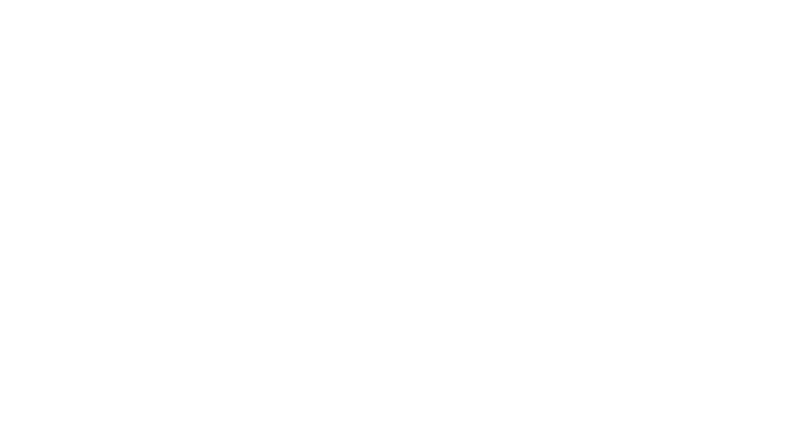

# Online Store - ddeoli 떨이
<!DOCTYPE html>
<html>
<head>
</head>
<body>

</body>
</html>

Projeto para a matéria **SSC0219 - Introdução ao desenvolvimento web**.

## Membros

- Beatriz Aparecida Diniz     | NUSP 11925430
- Lourenço de Salles Roselino | NUSP 11796805
- Melissa Motoki Nogueira     | NUSP 5588687

## Requisitos

- O sistema deve ter 2 tipos de usuários:
	- Administradores, responsaveis pela a adição de manutenção de novos produtos e usuário. A aplicação já vem com um admin com o nome de usuário _admin_ e a senha _admin_, o sistema armazena o id, telefone e email dos adminsitradores.
	- Clientes, que vão acessar o sistema para comprar roupas e acessórios, além de nome, endereço de entrega, telefone e email também deve ser armazenado o _grupo_ preferido do usuário.
- O sistema vende roupas e acessórios baseados no de _grupos_ de _kpop_, vai ser registrado ao produto seu nome, descrição, id, foto, preço, quantidade em estoque, quantidade a venda, quantidade vendida, grupo que ele foi inspirado e status da venda.
- O sistema deve permitir que o usuário adicione seus produtos a um carrinho, escolhendo quantidade e posteriormente compre o produto pagando por cartão de crédito.
- O sistema deve permitir que o usuário selecione seu _grupo_ ou _idol_ preferido, recebendo descontos e notificações por _newsletter_ ou _popup_ quando novos produtos chegarem.
- O sistema deve permitir que o usuário acompanhe os _status_ de seu pedido.
- O sistema deve ser acessivel e ter boa usuabilidade.
- O sistema deve ser responsivo.

## Descrição do projeto

O projeto consiste de uma _plataforma web_ para compra de roupas e acessórios baseados em grupos e _idols_ de _kpop_, permitindo a busca e compra de roupas, listagens por categorias e grupos e também inserção, atualização e remoção de produtos por admins. O sistema vai ser desenvolvido utilizando Vue e Bootstrap para o _front-end_ e NodeJs para o _back-end_ com _deploy_ do sistema podendo ser feito por Docker ou manualmente.

O nome _ddeoli(떨이)_ é uma palavra da língua coreana. O termo refere-se aos últimos itens no estoque de uma loja, o inventório final que o vendedor oferece (normalmente, a preços baixos) para esvaziar as prateleiras.

## Comentários sobre o código

## Estrutura (Diagrama de Navegação)

## Plano de teste

Existirão testes automatizados utilizando Jest e Postman, também vai haver um sistema de CI/CD com testes de perfomance para garantia do funcionamento do sistema durante o desenvolvimento.

## Procedimento de compilação

Para rodar a aplicação.

## Problemas enfrentados

Lorem ipsum dolor sit amet, consectetur adipiscing elit. Donec id metus varius, maximus enim quis, hendrerit libero. Nunc pretium nibh sed faucibus pulvinar. Phasellus in tristique orci, et lacinia justo. In nunc magna, condimentum a urna ut, aliquet pellentesque libero.

## Comentários

[Mockups](https://www.figma.com/file/SeyNRpdqZnJg8Dt9hJMbHp/Mockups---alexanderwang-inspired?node-id=0%3A1) das telas do sistema
